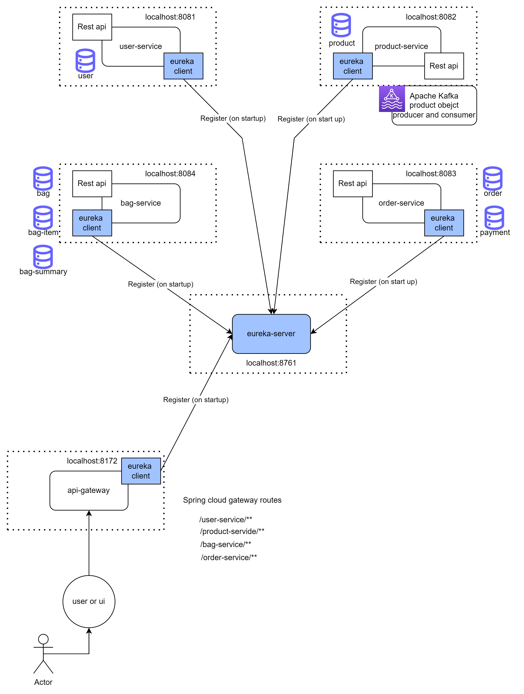
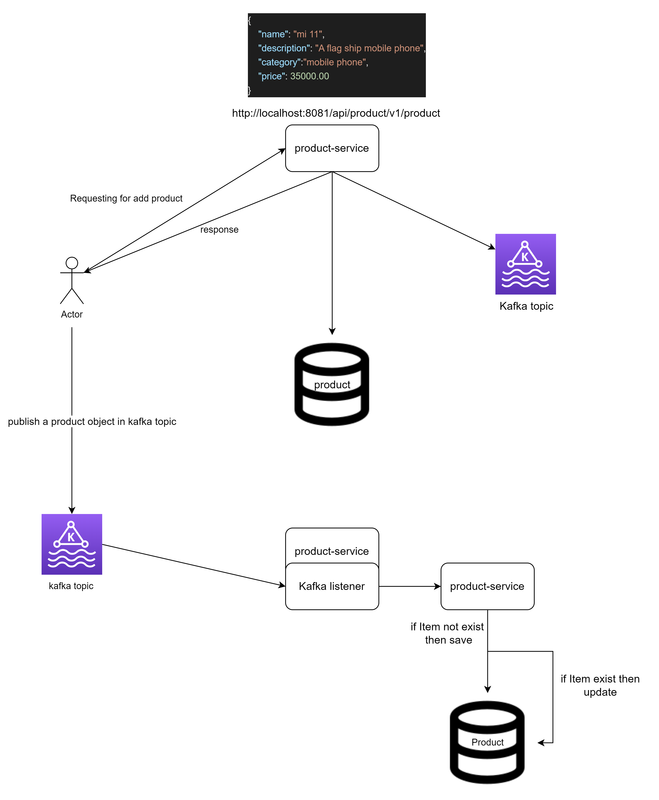
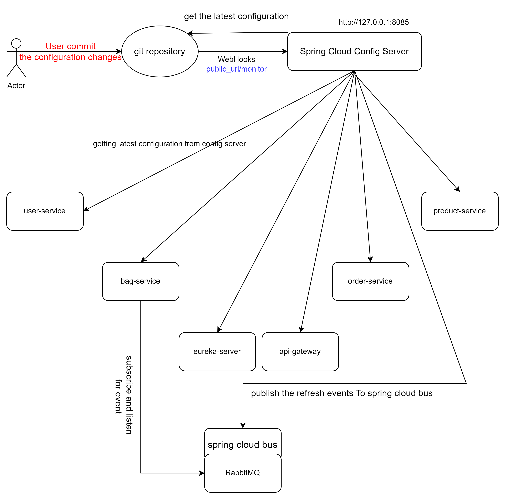

### Order management application

1. 4 different application - spring boot, web-flux
2. test- user-service -> covered for controller layer, service layer and with embedded monogdb.
3. kafka - product-service ->1. while post request item-object should save in db and publish in topic.
                            2. listen topic when object is published from kafka topic and validate iT
                                if item with same id is already exists then update otherwise save in db.

4. services registry - eureka server
5. api gateway - spring cloud gateway
6. config server - spring cloud config, spring cloud monitor, spring cloud bus, github webhook

#### Spring Cloud Bus
By using Actuator, we can refresh clients. However, in the cloud environment, we would need to go to every single client and reload configuration by accessing actuator endpoint.
To solve this problem, we can use Spring Cloud Bus.

When we do changes in remote git repository, Config server will show updated values straight away; however, the client won't. To make client see new file changes 
we just need to send an empty POST request to ‘/refresh' endpoint, which was added by actuator:

``
curl -H"content-type: application/json" -d{} http://localhost:8081/actuator/refresh
``
here -> -d {}: This option sends an empty JSON object ({}) as the request body.

``
curl -H"content-type: application/json" -d{} http://localhost:8085/actuator/busrefresh
``

The /actuator/busrefresh endpoint is commonly used in Spring Cloud applications to trigger a refresh of the configuration properties across the microservices.

#### Spring Cloud Monitor
We will use spring-cloud-config-monitor to monitor configuration changes and broadcast events using RabbitMQ as transport.

#### Github WebHook
We need to configure a GitHub Webhook. Let's go to GitHub and open our repository holding configuration properties. Now, let's select Settings and Webhook. Let's click on Add webhook button.

Payload URL is the URL for our config server ‘/monitor' endpoint. In our case the URL will be something like this:

public_url/monitor

Every time when we update webhook public url, every time we have to refresh bus using same way we did in above section.

you can create public url using local tunnel tool. you can visit this -> https://theboroer.github.io/localtunnel-www/

